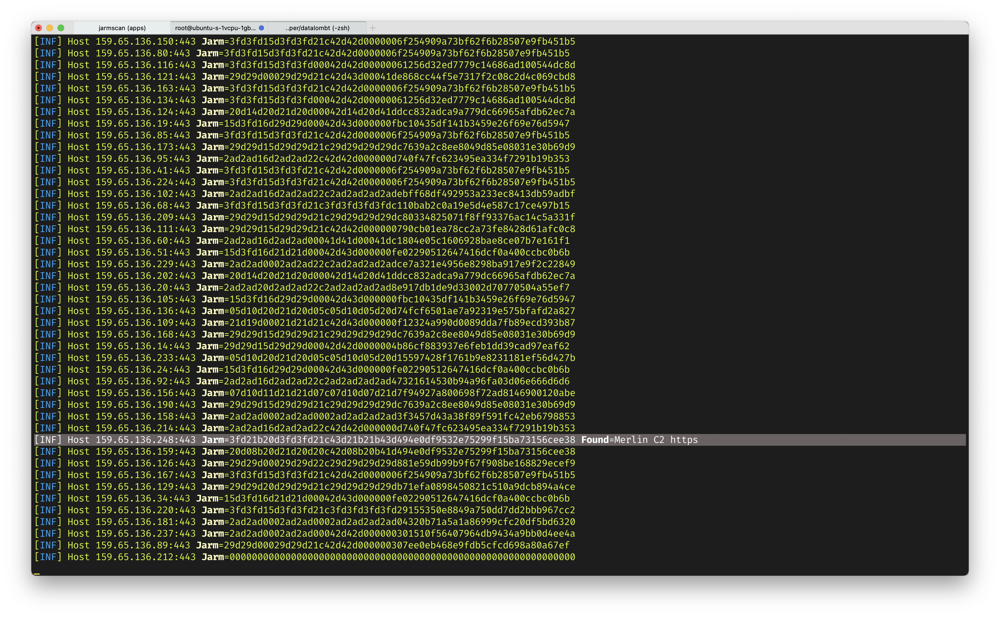

# C2-Detection-With-Jarm

### JARM is an active Transport Layer Security (TLS) server fingerprinting tool.

- Scanning with JARM provides the ability to identify and group malicious servers on the Internet.


### JARM fingerprints can be used to:

- Quickly verify that all servers in a group have the same TLS configuration.
- Group disparate servers on the internet by configuration, identifying that a server may belong to Google vs.Salesforce vs. Apple, for example.
- Identify default applications or infrastructure.
- Identify malware command and control infrastructure and other malicious servers on the Internet.


<p style="text-align: justify; letter-spacing: 0.002em;">
JARM works by actively sending 10 TLS Client Hello packets to a target TLS server and capturing specific attributes of the TLS Server Hello responses. The aggregated TLS server responses are then hashed in a specific way to produce the JARM fingerprint.
</p>

<p style="text-align: justify; letter-spacing: 0.002em;">
This is not the first time we’ve worked with TLS fingerprinting. In 2017 we developed JA3/S, a passive TLS client/server fingerprinting method now found on most network security tools. But where JA3/S is passive, fingerprinting clients and servers by listening to network traffic, JARM is an active server fingerprinting scanner. You can find out more about TLS negotiation and JA3/S passive fingerprinting here.
</p>


<p style="text-align: justify; letter-spacing: 0.002em;">
The 10 TLS Client Hello packets in JARM have been specially crafted to pull out unique responses in TLS servers. JARM sends different TLS versions, ciphers, and extensions in varying orders to gather unique responses. Does the server support TLS 1.3? Will it negotiate TLS 1.3 with 1.2 ciphers? If we order ciphers from weakest to strongest, which cipher will it pick? These are the types of unusual questions JARM is essentially asking the server to draw out the most unique responses. The 10 responses are then hashed to produce the JARM fingerprint.
</p>

## How to detect C2 With JARM

for example i have create simple tools to identify C2 servers with mallicious jarm list

```json
    var IsDB = []Metadata{
        Metadata{
            Hash: "07d14d16d21d21d00042d43d000000aa99ce74e2c6d013c745aa52b5cc042d",
            Type: "Metasploit",
        },
        Metadata{
            Hash: "22b22b09b22b22b22b22b22b22b22b352842cd5d6b0278445702035e06875c",
            Type: "Trickbot",
        },
        Metadata{
            Hash: "1dd40d40d00040d1dc1dd40d1dd40d3df2d6a0c2caaa0dc59908f0d3602943",
            Type: "AsyncRAT",
        },
        Metadata{
            Hash: "29d21b20d29d29d21c41d21b21b41d494e0df9532e75299f15ba73156cee38",
            Type: "Merlin C2",
        },
        Metadata{
            Hash: "3fd21b20d3fd3fd21c43d21b21b43d494e0df9532e75299f15ba73156cee38",
            Type: "Merlin C2 https",
        },
        // add ..
    }
```

- install jarm scan 
```sh
go get -u -v github.com/RumbleDiscovery/jarm-go/cmd/jarmscan
```

- install simple detections
```
git clone https://github.com/wahyuhadi/find-c2
cd find-c2

```

as sample i will scan subnet in 159.65.136.1/24 network to find mallicious server.

and run command inside a folder find-c2
```sh
jarmscan -p 443 159.65.136.1/24  | go run apps.go
```

Found merlin-c2 in IP 159.65.136.248 with port 443
